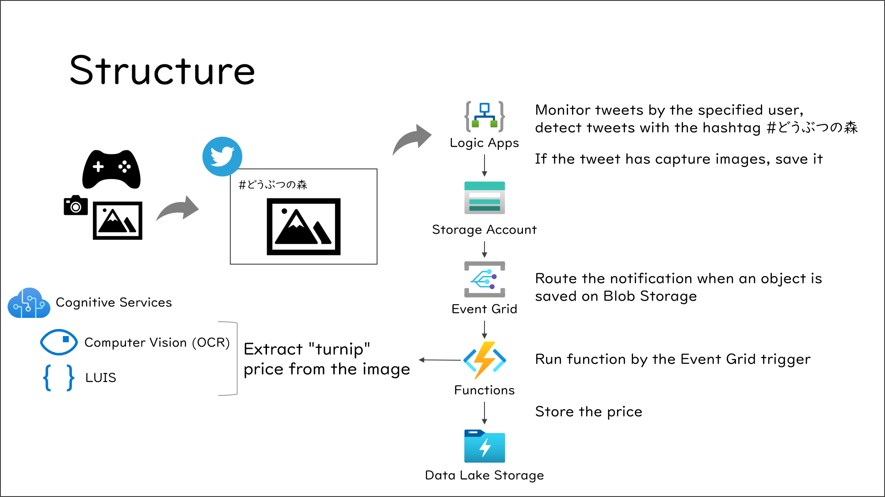

# animal-crossing-turnip-price-record

:construction: Under construction currently

## How to use this usually

- When tanukichi or tsubukichi is saying about turnip purchase price, capture the screen with Switch capture button.
- Tweet the capture to your Twitter account

That's all!

After that, your turnip price recording system collect the capture images and record the turnip purchase price automatically.

## Structure overview

## Feature overview

### Logic Apps

- Monitor your own tweets
- If the tweet has a hashtag #どうぶつの森 and has capture images, put the image on Blob Storage

### Integration between Blob Storage and Azure Functions

### 